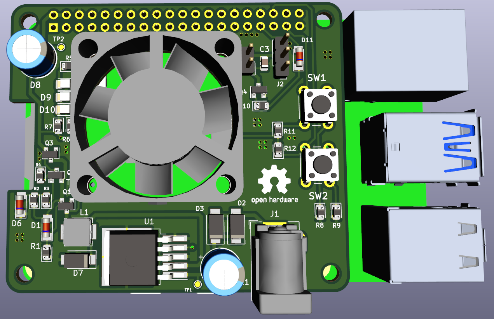

# Pihat-cooling
https://github.com/vanbwodonk/pihat-cooling

Raspberry Pi Hat with fan controller and external power supply. Raspberry pi need 5 Volt 15 watt power supply, this Pi Hat can replace it with 9/12 Volt power supply 18 watt or more. PCB is design with KiCad 5.1.



## Features

1. Cheap. At least from my local shop.

2. Wide range DC power input up to 40 Volt (or battery for my application).

3. Fan controller with switchable 5 volt or direct DC in supply. Change **J2** jumper close to pi header for 5 Volt fan supply or jumper close to button for direct DC supply. Usually pi fan is for 5 Volt, but i try 5 volt fan with 12 volt battery is no problem at all.

4. Overheat indicator with led (1 led programmable).

5. Over voltage + Reverse protection.

   You can replace all components. Just a little note for **Q1** and **Q3** (P-Channel Mosfet) drain current is 3 Ampere or more.

6. 2 programmable button (i used it for shutdown & reboot). 

## Installation

Download python scripts from:

```bash
pip3 install RPi.GPIO
mkdir scripts
cd scripts
wget https://raw.githubusercontent.com/vanbwodonk/pihat-cooling/master/Firmware/Python/main.py
```

Running:

```bash
sudo python3 /home/pi/scripts/main.py
```

## Donation
If this project help you, you can give me a cup of coffee :) 

[](https://www.paypal.com/paypalme/arifdarma)